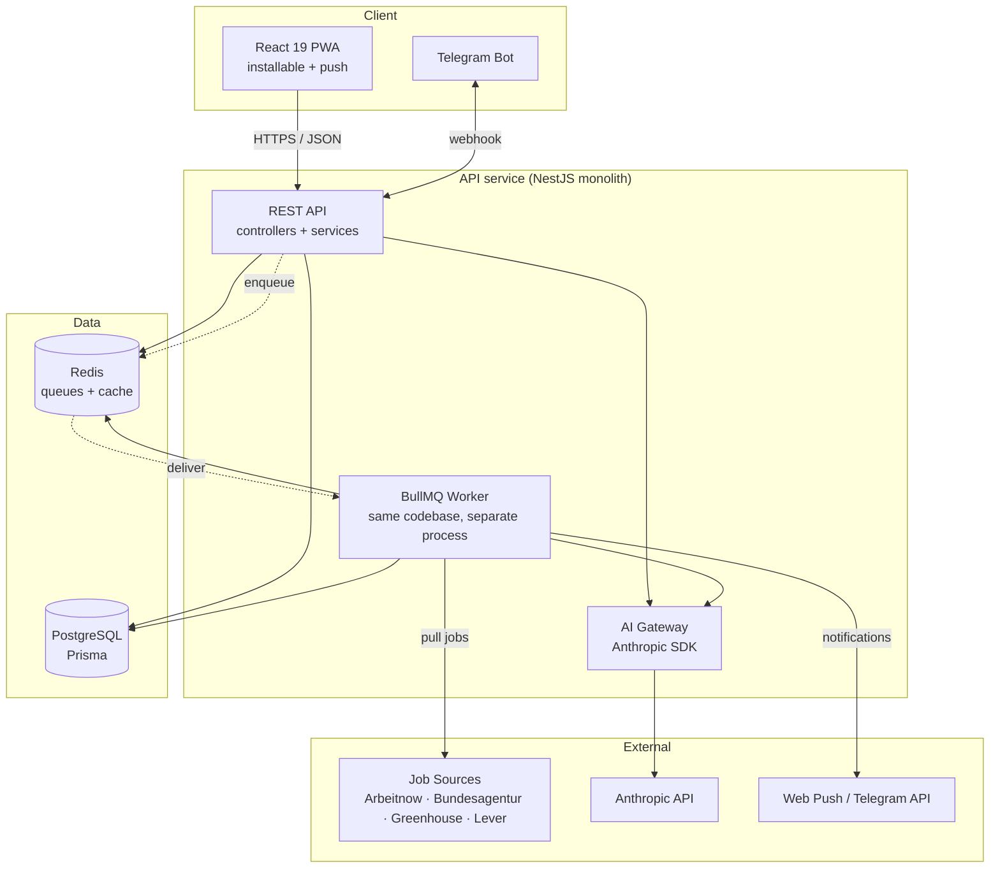
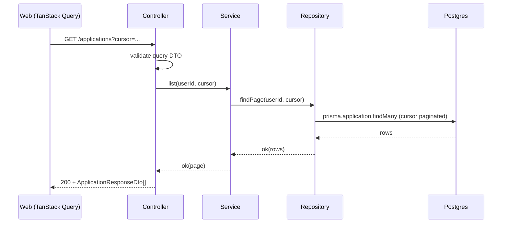
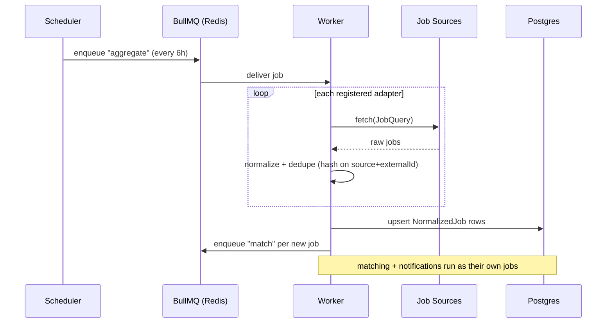
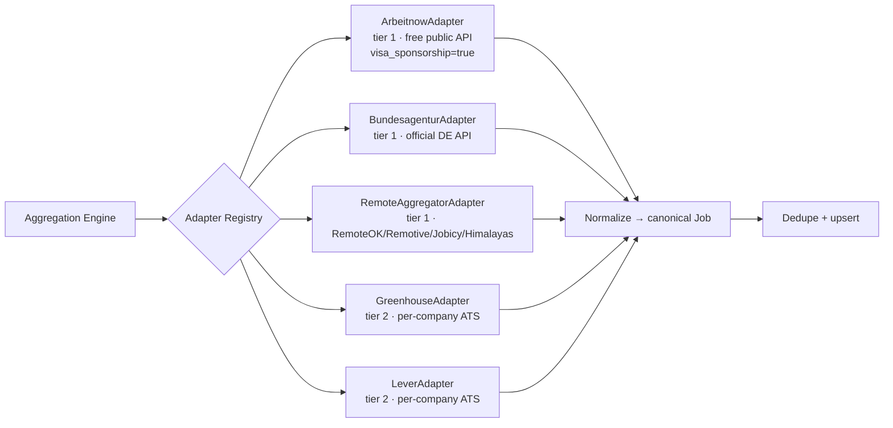
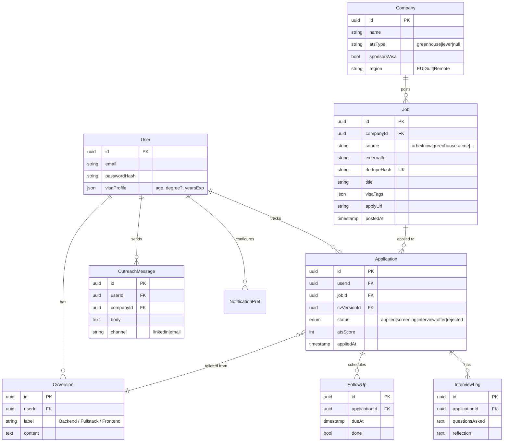
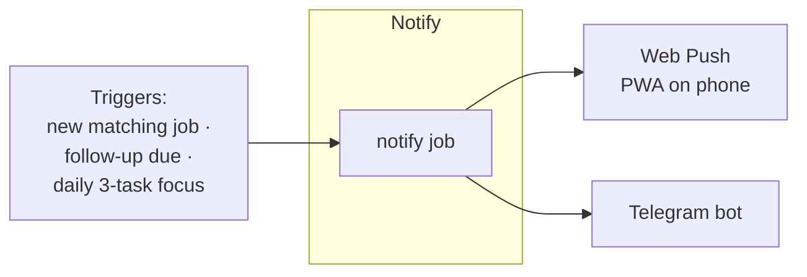
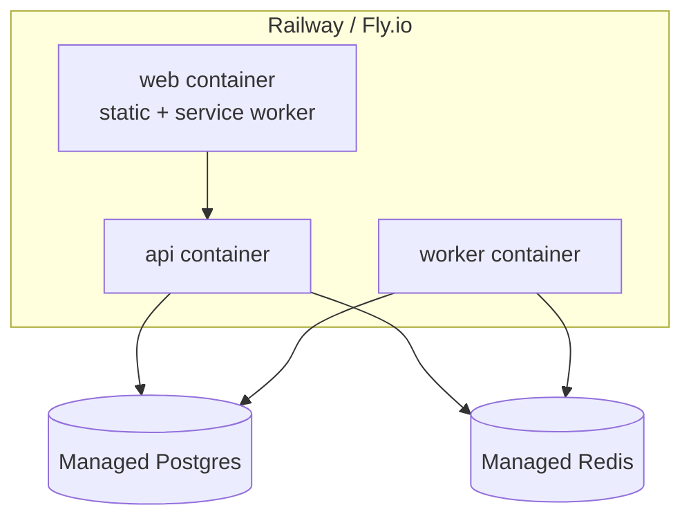

# NexaHire — System Design

How the pieces behave at runtime. Read `architecture.md` first for *where code lives*;
this doc is *how it runs*. Diagrams are Mermaid (render on GitHub and in most viewers).

---

## 1. High-level components

Two processes, one codebase: the **API** answers requests fast; the **Worker**
does everything slow or external (aggregation, AI, notifications). They share
Postgres and Redis. This is the smallest setup that still keeps requests snappy.

---

## 2. Core request flow (sync path)

Example: user opens the board.

No external calls on the request path — so the UI is always fast. Anything that
would block goes to the queue (next section).

---

## 3. Async flow (the queue is the backbone)

Example: a job-aggregation run.

**Queues:** `aggregate`, `match`, `tailor-cv`, `ats-score`, `outreach`,
`notify`, `follow-up`. Every processor is **idempotent** (safe to retry) and
**dedupes** by a stable key, because sources re-post the same listing.

---

## 4. The job-sourcing engine (the heart of the product)

The honest reality: there is no single API for "all jobs." We aggregate
legitimate, stable sources through one adapter interface, and deep-link the rest.

**Three tiers (see `architecture.md` §5b for the interface):**

- **Tier 1 — direct public APIs (the backbone).** Free, stable, no auth or
  trivial header. `Arbeitnow` (has a `visa_sponsorship=true` param, data sourced
  from ATSs), the official German `Bundesagentur für Arbeit` API
  (`rest.arbeitsagentur.de`, header `X-API-Key: jobboerse-jobsuche`, 1M+ jobs),
  and remote aggregators (RemoteOK / Remotive / Jobicy / Himalayas).
- **Tier 2 — per-company ATS APIs (the senior move).** Maintain a target-company
  list (NL recognized sponsors + Gulf companies + EU startups), detect each
  company's ATS, and pull structured JSON straight from the employer:
  - Greenhouse: `https://boards-api.greenhouse.io/v1/boards/{company}/jobs`
  - Lever: `https://api.lever.co/v0/postings/{company}?mode=json`
  - (Ashby / Workable: same idea.)
  Zero anti-bot, never breaks, and surfaces roles before they hit aggregators.
- **Tier 3 — deep-link, don't scrape.** For LinkedIn / Bayt / Indeed / Wellfound,
  generate a pre-filtered search URL the user opens in one click. Apply manually,
  zero friction, fully within terms of service.

> **Hard rule:** no HTML scraping of boards that prohibit it. It violates ToS,
> risks account bans, and breaks on every markup change. The tiers above avoid it.

**Eligibility tagging.** Each normalized job is tagged against the user's visa
options (NL Highly-Skilled-Migrant, DE Blue Card / IT-specialist route, Gulf,
remote-EUR) using the 2026 thresholds, so the board can filter to roles the user
can actually take.

---

## 5. Data model

`Job.dedupeHash` (unique) is `sha1(source + externalId)` — the safety net against
the same listing arriving from two sources.

---

## 6. AI integration

All model use is behind `core/ai/ai.service.ts`. Each capability is a typed
method with a versioned prompt; the web app never touches Anthropic (key stays
server-side).

| Capability             | Input                       | Output (structured)              |
|------------------------|-----------------------------|----------------------------------|
| `scoreAts`             | JD + CV                     | score 0–100, missing keywords    |
| `tailorCv`             | base CV + JD                | rewritten bullets per role       |
| `draftOutreach`        | company card + role         | LinkedIn/email message           |
| `simulateNegotiation`  | offer + target + transcript | recruiter turn + coaching note   |
| `companyResearchCard`  | company + recent web search | tech stack, news, sponsor signal |

**Practices:** request structured JSON (parse + validate with Zod, never regex);
always set `max_tokens`; handle the rate-limit/error branch as a first-class path;
use **prompt caching** for the stable parts (base CV, system prompt) to cut cost;
run all of it as `tailor-cv` / `ats-score` queue jobs so requests never block.

---

## 7. Companion layer — "always with me"

- **PWA + Web Push** — the React app installs to the home screen and receives
  push (new match, follow-up reminder, today's tasks). Service worker + VAPID.
- **Telegram bot** — same NestJS backend via webhook. Pushes new jobs and the
  daily focus list; accepts commands (`/today`, `/applied <id>`). This is the
  simplest literal "always with you" channel.
- **Daily Focus** — morning: 3 tasks (apply to 3, reach out to 2); evening: log
  done + streak. Daily discipline is what actually produces an offer in weeks.

---

## 8. Deployment topology

Three small containers from one repo (web, api, worker) + managed Postgres &
Redis. GitHub Actions runs lint + typecheck + tests on PR, builds images, and
deploys on merge to `main`. Cheap enough to run on a hobby budget.

---

## 9. Cross-cutting concerns

- **Auth** — email/password → JWT in an httpOnly cookie. Guard on every private
  route. No tokens in `localStorage`.
- **Config** — validated once at boot (`@nexahire/config`). The app refuses to
  start with a missing/invalid env var — fail fast, not at 2 a.m.
- **Observability** — structured logging (pino) with a request id; a `/health`
  endpoint; counts for jobs aggregated, AI tokens used, notifications sent. This
  is the Sprint 7 "senior signal" layer.
- **Rate limiting & cost** — throttle AI endpoints per user; cache company
  research; respect each source's rate limits in the adapter.
- **Security** — Helmet headers, CORS allow-list, DTO validation everywhere,
  secrets only in env, dependency audit in CI.

---

## 10. Scaling story (what you say in an interview)

The monolith handles a single user (you) effortlessly and would serve thousands.
If load ever demanded it: the **worker scales horizontally first** (more BullMQ
consumers — aggregation and AI are the heavy parts), then Postgres gets read
replicas, then a hot module (e.g. sourcing) can be peeled into its own service
because the adapter boundary already isolates it. Designed to split, not split
prematurely — that sentence alone is a senior signal.
